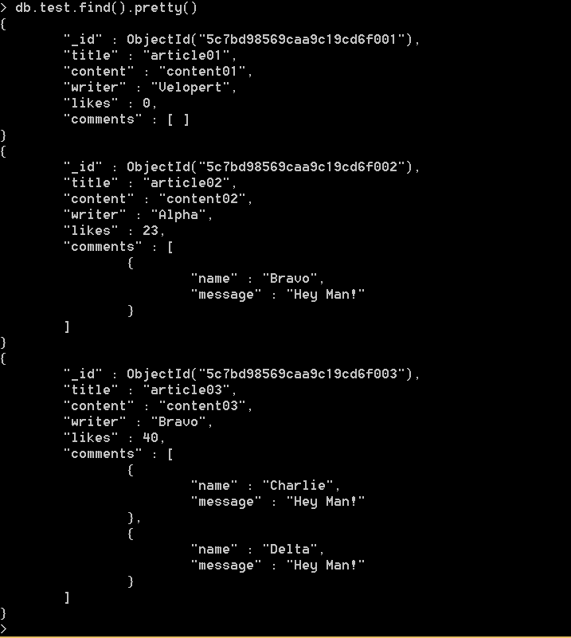
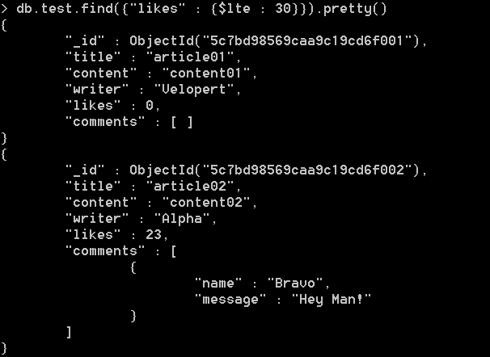
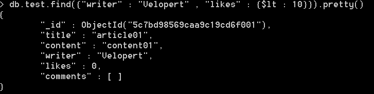
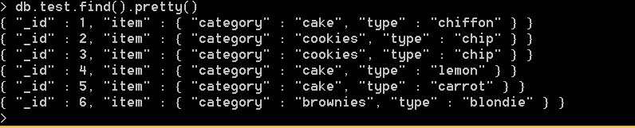
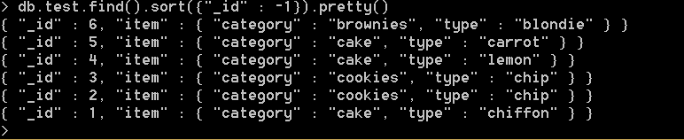

MongoDB를 직접 이용해보니, MySQL보다 형식에 있어 자유도가 높아서 편리한 것 같다.
기본적인 기능들 실습해보며 연습해봤다.

```
const a = function(){
    console.log(ddd) 
}
```



기본적인 test 데이터를 만들어 find().pretty()를 이용하여 확인한 모습



다양한 조건을 쉽게 적용할 수 있다



여러 조건을 ',' 를 이용하여 연결하면 되기 때문에 간편한 것 같다



또 다른 데이터를 만든 모습



정렬하는 법도 쉽다


참고 : https://velopert.com/516
 