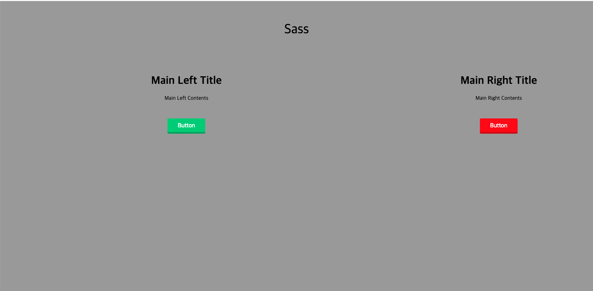

Sass를 이용하여 css를 연습해보았다.
이미 css를 이미 알고있으면 어렵지않게 배울 수 있는 것 같다.


index.html
```
<!DOCTYPE html>
<html>
<head>
  <meta charset="UTF-8">
  <link rel="stylesheet" href="style/style.css">
  <title>Document</title>
</head>
<body>
  <div class="title">
    Sass
  </div>
  <div class="main-left">
    <h1>
      Main Left Title
    </h1>
    <div class="main-left-content">
      Main Left Contents
    </div>
    <button class="btn-left">
      Button
    </button>
  </div>
  <div class="main-right">
    <h1>
      Main Right Title
    </h1>
    <div class="main-right-content">
    Main Right Contents
    </div>
    <button class="btn-right">
      Button
    </button>
  </div>
</body>
</html>
```


style.scss
```
@import "button.scss";


$primary-color : #999;


body {
  background-color : $primary-color;
  text-align : center;
  padding-top : 3%;
}

.title {
  color : black;
  font-size : 40px;
  padding-bottom : 5%;
}

.main-left {
  float : left;
  width : 600px/960px * 100%;
}

.main-right {
 float : right;
 width : 300px/960px * 100%;
}

.main-left-content {
  padding-bottom : 50px;
}

.main-right-content {
  padding-bottom : 50px;
}
```


button.scss
```
$buttonColor1: #2ecc71;
$buttonDark1: darken($buttonColor1, 10%);
$buttonDarker1: darken($buttonDark1, 10%);
$buttonColor2: red;
$buttonDark2: darken($buttonColor2, 10%);
$buttonDarker2: darken($buttonDark2, 10%);


%btn-template {
  border-radius: 3px;
  border: 0;
  color: white;
  font-size: 17px;
  padding: 10px 30px;
  margin-top : 0px;
  display: inline-block;
  outline: 0;
}


.btn-left {
  @extend %btn-template ;
  background : $buttonColor1;
  box-shadow: 0px 5px 0px $buttonDark1;
  &:hover {
    background: $buttonDark1;
    box-shadow: 0px 5px 0px $buttonDarker1;
  }
  &:active {
    box-shadow: none;
    margin-top: 5px;
  }
}

.btn-right {
  @extend %btn-template ;
  background : $buttonColor2;
  box-shadow: 0px 5px 0px $buttonDark2;
  &:hover {
    background: $buttonDark2;
    box-shadow: 0px 5px 0px $buttonDarker2;
  }
  &:active {
    box-shadow: none;
    margin-top: 5px;
  }
}
```


최종적으로 변환된 style.css파일.
scss 파일은 그 자체로 웹에서 동작할 수 없기 때문에 css로 컴파일해야한다.
```
.btn-left, .btn-right {
  border-radius: 3px;
  border: 0;
  color: white;
  font-size: 17px;
  padding: 10px 30px;
  margin-top: 0px;
  display: inline-block;
  outline: 0; }

.btn-left {
  background: #2ecc71;
  box-shadow: 0px 5px 0px #25a25a; }
  .btn-left:hover {
    background: #25a25a;
    box-shadow: 0px 5px 0px #1b7943; }
  .btn-left:active {
    box-shadow: none;
    margin-top: 5px; }

.btn-right {
  background: red;
  box-shadow: 0px 5px 0px #cc0000; }
  .btn-right:hover {
    background: #cc0000;
    box-shadow: 0px 5px 0px #990000; }
  .btn-right:active {
    box-shadow: none;
    margin-top: 5px; }

body {
  background-color: #999;
  text-align: center;
  padding-top: 3%; }

.title {
  color: black;
  font-size: 40px;
  padding-bottom: 5%; }

.main-left {
  float: left;
  width: 62.5%; }

.main-right {
  float: right;
  width: 31.25%; }

.main-left-content {
  padding-bottom: 50px; }

.main-right-content {
  padding-bottom: 50px; }
```


최종 결과물.
