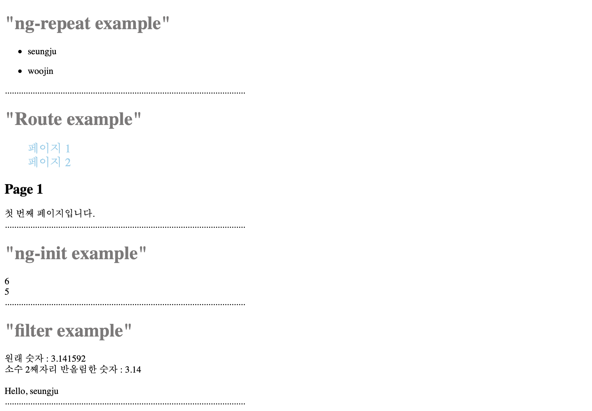

angularJS 공부하기 좋은 사이트를 찾아냈다.

https://www.guru99.com/angularjs-introduction.html

사이트 1강~11강까지의 학습내용을 복습하며 코드예제를 만들어봤다. ng-repeat, route, ng-init, filter의 개념 위주로 공부했다. 간단한 예제들이어서 저번 주에 읽은 angularJS책 내용을 복습하기 좋았다.


"index.html"
```
<!DOCTYPE html>
<html ng-app="App">

  <head>
    <meta charset="utf-8" />
    <title>Document</title>
    <script src="https://ajax.googleapis.com/ajax/libs/angularjs/1.7.7/angular.min.js"></script>
    <script src="https://code.angularjs.org/1.7.7/angular-route.js"></script>
    <script src="app.js"></script>
    <link rel="stylesheet" href="app.css">
  </head>

  <body>

    <h1 class="subject">"ng-repeat example"</h1>
    <div ng-controller="ListMaker">
        <ul ng-repeat="student in students">
            <li>
                {{student.name}}
            </li>
        </ul>
    </div>
    ........................................................................................................


    <h1 class="subject">"Route example"</h1>
    <div class="container">
        <ul>
            <li class="event_li"><a class="event_a" href="#!Page1"> 페이지 1 </a></li>     
            <li class="event_li"><a class="event_a" href="#!Page2"> 페이지 2 </a></li>
        </ul>
        <div ng-view></div>
    </div>
    ........................................................................................................


    <h1 class="subject">"ng-init example"</h1>
    <div ng-init="margin=2 ; profit=3">
        {{margin * profit}}
    </div>


    <div ng-controller="ValueIndicator">
        {{value}}
    </div>
    ........................................................................................................


    <h1 class="subject">"filter example"</h1>
    <div ng-controller="FilterRoundOff">
        원래 숫자 : {{pi}}
        <br>
        소수 2째자리 반올림한 숫자 : {{pi | number : 2}}
    </div>
    <br>
    <div ng-controller="DemoController">
        {{developer | CustomFilter}}
    </div>
    ........................................................................................................

  </body>

</html>
```


"app.js"
```
var app = angular.module('App', ['ngRoute']);


    app.config(function($routeProvider){
        $routeProvider
        .when("/Page1", {
            templateUrl : "template/page1.html",
            controller: "Page1Controller"
        })
        .when("/Page2", {
            templateUrl: "template/page2.html",
            controller: "Page2Controller"
        })
        .otherwise ({
            redirectTo: '/Page1'
        });
    });


    app.controller('ListMaker', function($scope) {
        $scope.students = [
            { "name" : "seungju" },
            { "name" : "woojin" }
        ];
    });


    app.controller("Page1Controller", function($scope) {
        $scope.message = "첫 번째 페이지입니다.";
    });
    

    app.controller("Page2Controller",function($scope){
        $scope.message = "두 번째 페이지입니다.";
    });


    app.controller("ValueIndicator" , function($scope){
        $scope.a = 2;
        $scope.b = 3;
        $scope.value = $scope.$eval('a+b')
    });


    app.controller("FilterRoundOff" , function($scope){
        $scope.pi = 3.141592;
    });


    app.filter('CustomFilter',function(){
        return function(input)
        {
            return "Hello, " + input
        }
    });


    app.controller("DemoController",function($scope){

        $scope.developer ="seungju";
     });
```


"app.css"
```
.event_a {
    color : skyblue;
    font-size : 20px;
    text-decoration : none; 
}


.event_a:hover {
    opacity : 0.7;
}


.event_li {
    list-style-type : none;
}


.subject {
    color : #7c7979;
}
```


출력된 웹페이지
