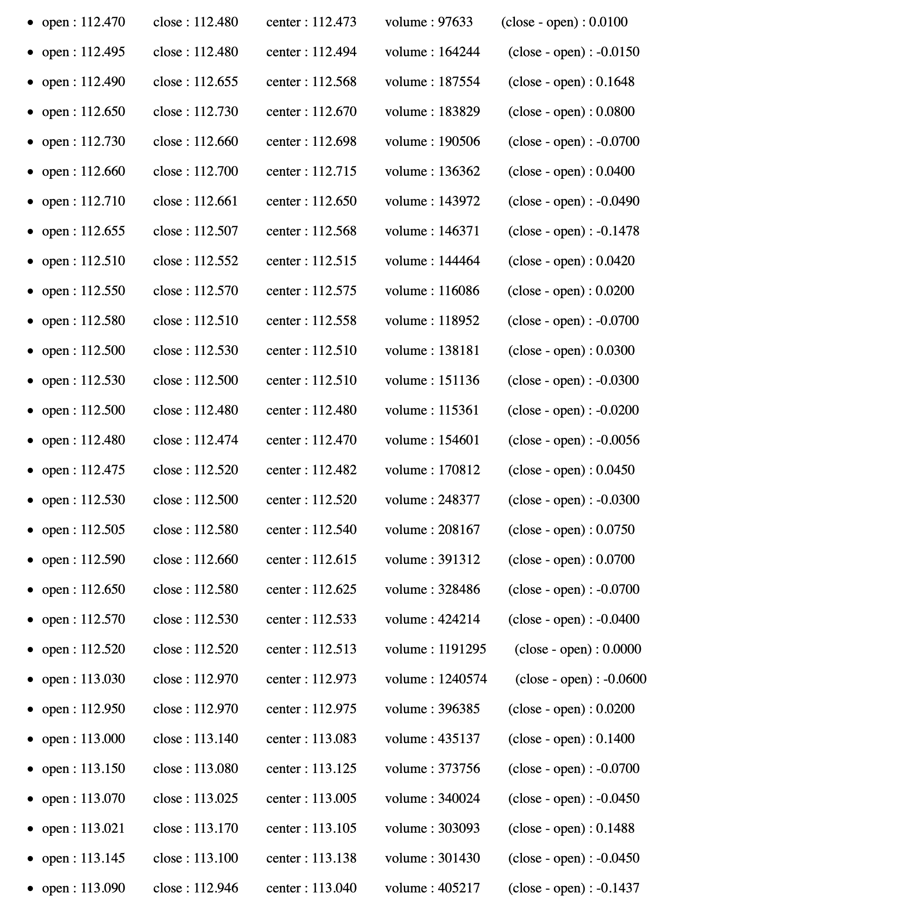

AngularJS 2 에서 ng-if 를 이용하여 5분봉이 양봉인지 음봉인지 판단해봤다.


API 링크 : https://www.alphavantage.co/query?function=TIME_SERIES_INTRADAY&symbol=MSFT&interval=5min&apikey=demo


"index.html"
```
<!DOCTYPE html>
<html ng-app="App">
  <script src="https://ajax.googleapis.com/ajax/libs/angularjs/1.3.2/angular.min.js"></script>
  <script src="https://code.angularjs.org/1.7.7/angular-route.js"></script>
  <script src="app.js"></script>
  <link rel="stylesheet" href="app.css">
<head>
  <meta charset="UTF-8">
  <title>Document</title>
</head>
<body>

  <div ng-controller="customersCtrl">
    <ul ng-repeat="data in stockdatas">
      <li style="display : flex; flex-direction : left;">
        open : {{data['1. open'] | number : 3}}
        &nbsp;&nbsp;&nbsp;&nbsp;&nbsp;&nbsp;
        close : {{data['4. close'] | number : 3}}
        &nbsp;&nbsp;&nbsp;&nbsp;&nbsp;&nbsp;
        center : {{data['2. high']/2 + data['3. low']/2 | number : 3}}
        &nbsp;&nbsp;&nbsp;&nbsp;&nbsp;&nbsp;
        volume : {{data['5. volume']}}
        &nbsp;&nbsp;&nbsp;&nbsp;&nbsp;&nbsp;
        (close - open) : {{data['4. close'] - data['1. open'] | number : 4}}
        &nbsp;&nbsp;&nbsp;&nbsp;&nbsp;&nbsp;

        <div ng-if="upfinder(data['4. close'] - data['1. open'])">
          <div>
            up
          </div>
        </div>

        <div ng-if="downfinder(data['4. close'] - data['1. open'])">
          <div>
            down
          </div>
        </div>

      </li>
    </ul>
  </div>

</body>
</html>
```


"app.js"
```
var app = angular.module('App', ['ngRoute']);


app.controller('customersCtrl', ['$scope', '$http', function($scope, $http) {
  $http.get("https://www.alphavantage.co/query?function=TIME_SERIES_INTRADAY&symbol=MSFT&interval=5min&apikey=demo")
  .success(function (response){

    $scope.stockdatas = response['Time Series (5min)'];

    $scope.upfinder = function(number){
      if(number > 0){
        return true
      }
    }

    $scope.downfinder = function(number){
      if(number < 0){
        return true
      }
    }

  });
}]);
```


출력된 웹페이지
